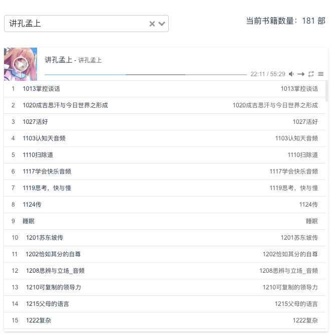
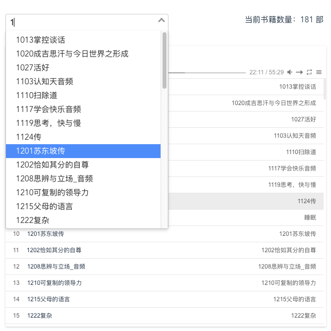

# 听书
闲置服务器跑个听书应用

## 目录介绍
public/store/ mp3文件目录

frontend 源码前端目录

## 安装运行
### 下载依赖
go mod tidy

go mod vendor 
### 编译
go build
### 运行
./listener

## 访问地址
http://127.0.0.1:8080/public

## 服务器部署如何从网盘导入音频文件？
https://github.com/iikira/BaiduPCS-Go

